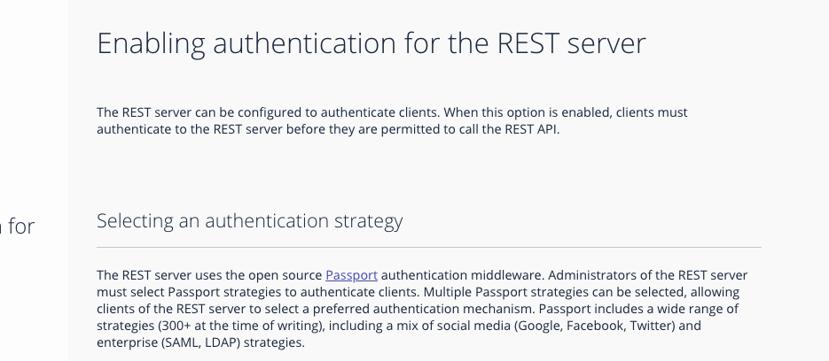

# Hyperledger Composer Auth Strategies

## Problem: Unable to use passport-local strategy as pluggable strategy

This repo covers the officials tutorials for security in Hyperledger Composer:
* [Github](https://hyperledger.github.io/composer/v0.16//integrating/enabling-rest-authentication.html)
* [Google](https://hyperledger.github.io/composer/latest/tutorials/google_oauth2_rest)

#### Requirements:
* node v8.0.0
* npm 5.0.0
* composer-rest-server v0.19.5

## General notes for release - 0.19.5:
https://github.com/hyperledger/composer/releases?after=v0.19.6

### Based on Loopback:
https://github.com/hyperledger/composer/tree/v0.19.5/packages/loopback-connector-composer

### Composer rest server specification:
https://github.com/hyperledger/composer/blob/v0.19.5/packages/composer-rest-server/package.json

Notice "loopback-component-passport" is present in the config above as mentioned in https://loopback.io/doc/en/lb3/Configuring-providers.json.html

### [github-auth](github-auth):

#### Create and install archive (.bna)
```console 
composer archive create --sourceType dir --sourceName  . -a github-auth@0.0.1.bna
composer network install --card PeerAdmin@hlfv1 --archiveFile github-auth@0.0.1.bna
````

#### Start business network definition
```console 
composer network start --card PeerAdmin@hlfv1 --networkName github-auth --networkVersion 0.0.1 --networkAdmin admin --networkAdminEnrollSecret adminpw --file github-auth.card
```

#### Import the admin card
```console 
composer card import -f github-auth.card
composer network ping -c admin@github-auth
```

Reference:
https://hyperledger.github.io/composer/v0.16//integrating/enabling-rest-authentication.html

* add your credentials to `env.txt`

#### Load the environment variables
```console 
source `env.txt`
echo $COMPOSER_PROVIDERS
```
#### Install `passport-github` package and start rest server
```console 
npm install -g passport-github
composer-rest-server -c admin@github-auth -a true
```

### [google-auth](google-auth):

Reference:
https://hyperledger.github.io/composer/latest/tutorials/google_oauth2_rest


### [local-auth](local-auth):
  References:
  https://loopback.io/doc/en/lb2/Configuring-providers.json.html

  The local auth is not embedded with default routes / callback as required by local strategy:
  ``` json
   {
    "authPath": "/auth/local",    
    "failureRedirect": "/local",
    "successRedirect": "/auth/account"
    }
  ``` 

So the user would need to customize the official image:
https://hub.docker.com/r/hyperledger/composer-rest-server/

By modifying the file:
https://github.com/hyperledger/composer/blob/v0.19.5/packages/composer-rest-server/server/server.js

As noticed in line 151:
```js 
  app.get('/auth/logout', function (req, res, next) { ...
```

A default route in Hyperledger Composer Rest Server, but any route required
by passport-local configuration is not covered by default, resulting in:


Nativelly in loopback we customize it by adding to server.js:

```js 
  let localStrategy = require('local-strategy').Strategy; 
  app.use('/', localStrategy);
```

create each equivalent route in the middleware:

```js
  app.get('/auth/account', function (req, res, next) { ...
  app.get('/auth/local', function (req, res, next) { ...
  app.get('/local', function (req, res, next) { ...
```

So, there's not a clear distinction between Passport.js capabilities and Hyperledger Composer Rest Server
coverage over this package, what easily brings confusion:

https://hyperledger.github.io/composer/v0.19/integrating/enabling-rest-authentication

<!-- <a href="url"></a> -->

